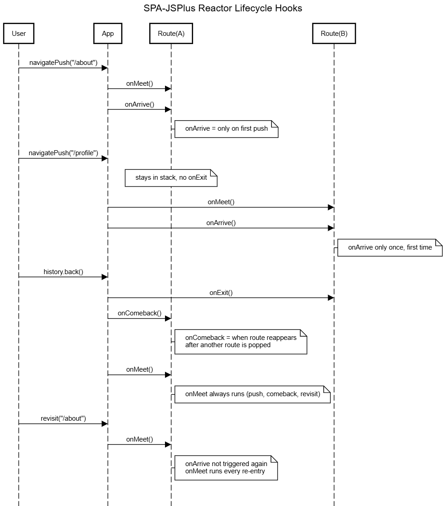

# SPA-JSPLUS

SPA-JSPlus is a simple implementation of a **Single Page Application (SPA)** built with **vanilla JavaScript**.  
This project is **not a library or framework**, but rather a **pattern/example** that demonstrates how SPA needs can be solved without relying on modern frameworks.  

The goals are:  
- To inspire developers who still enjoy working with **vanillaJS**.  
- To provide a real-world example of how routing, state, and lifecycle management can be achieved with minimal code.  
- To be easily adopted or customized for project-specific needs.  

> **Note:** This project has been modernized and extended with advanced demos:  
> - [The latest engine (spa/2.0.2)](./spa/2.0.2)   
> - [The bundler machine](./bundler)  
> - [Demo SPA Blog (SPA with Builder)](./examples/demo-blog)  
> - [Demo Recipe App](./examples/demo-recipe-app)  
>   
> You can also try the live demos here:  
> - Core SPA Demo: [https://spajsplus.netlify.app/](https://spajsplus.netlify.app/)  
> - Demo Blog: [https://spademoblog.netlify.app/](https://spademoblog.netlify.app/)  
> - Demo Recipe App: [https://spademorecipeapp.netlify.app/](https://spademorecipeapp.netlify.app/)

---

## Table of Contents
- [Why JS+ Exists](#why-js-exists)
- [Features](#features)
- [How It Works](#how-it-works)
  - [Routing](#routing)
  - [Navigation](#navigation)
  - [Lifecycle Hooks](#lifecycle-hooks)
  - [Lifecycle Hooks Diagram](#lifecycle-hooks-diagram)
  - [Hashtag mode vs History API](#hashtag-mode-vs-history-api)
  - [Query String & Params](#query-string--params)
- [SPA-JSPlus (CDN Build)](#spa-jsplus-cdn-build)
- [Live Demo](#live-demo)
- [Notes](#notes)
- [Learn More](#learn-more)
- [License](#license)

---

## Why JS+ Exists

Too many web projects become tangled in `node_modules`, build scripts, and dependency churn.  
**JS+** is a deliberate counterpoint: a single-file loader written in plain JavaScript that you can read, modify, and ship — no build pipeline, no package install, no surprise transitive dependency updates.

If you want something you can drop into an HTML file and understand in one sitting, this is it.

---

## Features

- Simple and lightweight, no external dependencies  
- Support for both History API and Hash mode routing  
- Easy-to-use API for defining routes  
- Lifecycle hooks: `onMeet`, `onArrive`, `onExit`, `onComeback`  
- Query string and parameter support  
- Transition notifier system  
- Works in local file system and production servers

---

## How It Works

### Routing
SPA-JSPlus uses the `reactor()` method to register routes.

```js
app.reactor("/about", function(ctx) {
  // In v2.0.2:
  //
  // - Assigning a string → will be rendered as HTML
  ctx.container = "<h1>About Page</h1>";

  // - Assigning a Node → DOM node is directly used
  // const el = document.createElement("h1");
  // el.innerText = "About Page";
  // ctx.container = el;
  //
  // - Assigning a function → evaluated fresh each visit
  // ctx.container = () => el;
  // Or
  // ctx.container = () => "<h1>Dynamic About</h1>";
});
```

### Navigation
```js
app.navigatePush("/about");
app.navigateReplace("/about");
app.navigateClear();
```

### Lifecycle Hooks

Each route supports simple lifecycle hooks. Conceptually, the routing system works like a **stack data structure**:

-   `onMeet` → executed **every time** entering the route, whether it is
    newly pushed into the stack or re-entered after the next stack has
    been popped.  
-   `onArrive` → executed **only when** the route is first pushed onto
    the stack (new arrival).  
-   `onExit` → executed **before leaving** the route, when it is about
    to be popped from the stack.  
-   `onComeback` → executed when returning to a previously visited
    route, i.e., after the next stack is popped.

#### Behavior Summary (stack analogy)

-   **Push (new route)** → `onMeet` + `onArrive`  
-   **Pop (go back)** → `onExit` (on current route) + `onComeback` (on
    previous route)  
-   **Revisit** → `onMeet` (always runs)

#### `set` and `delay`

Each lifecycle hook has two properties:

-   **`.set`** → function to define what happens in that lifecycle.  
    Default is an empty no-op function.

    Example:

    ``` js
    // @override
    ctx.onMeet.set = function() {
      // write code here
    };
    ```

-   **`.delay`** → integer value in milliseconds to delay execution.  
    Default = `0` (no delay).

    Example:

    ``` js
    ctx.onMeet.delay = 1500; // 1500 ms delay
    ```

------------------------------------------------------------------------

#### Special behaviors

- **Hard exit is now handled with `ctx.endReactor` (replaces `.delay = -1`)**  
  To force a route to immediately clear history when exiting:
  ```js
  ctx.endReactor = true; 
  ```
  Or with runtime logic:
  ```js
  ctx.endReactor = () => ctx.params.forceExit === "1";
  ```

- If `.set` returns `false` on **onExit**, it will **block navigation back**.

  Example:
  ```js
  ctx.onExit.set = () => false; // prevent leaving this route
  ```

---

### Lifecycle Hooks Diagram

The following diagram illustrates the transition flow of lifecycle hooks  
(`onMeet`, `onArrive`, `onExit`, `onComeback`) in SPA-JSPlus:



#### Rules Summary
- **onArrive** → only once, when the route is first pushed onto the stack.  
- **onExit** → triggered before a route is popped from the stack (e.g., `history.back`).  
- **onComeback** → triggered when returning to a previously visited route after another route is popped.  
- **onMeet** → always runs whenever a route becomes active (new push, comeback, or revisit).  

---

### Hashtag mode vs History API
- If the server does not support the History API → automatically uses hashtag mode (`#/about`).  
- If the server supports History API → clean URLs like `/about` can be used.  

---

### Query String & Params
Supports parsing params (`/search/{q}`) and query strings (`/end?arrivalTime=10:00`).  

Access them via:
```js
ctx.params.q
ctx.query.arrivalTime
```

---

## SPA-JSPlus (CDN Build)

This folder contains the **CDN build workflow** for SPA-JSPlus v2.0.2.  
It allows you to generate a single-file bundle that can be used directly in browsers without ES modules.

### How to Generate

Run the bundler script:

```bash
cd spa/2.0.2
node bundle.js
```

This will output:

```
spa/2.0.2/cdn/amd.prod.js
```

### Usage in Browser

Simply include the generated file in your HTML:

```html
<script src="./spa/2.0.2/cdn/amd.prod.js"></script>
<script>
  // Access Spa from global scope
  const app = new window.Spa();

  app.reactor("/", (ctx) => {
    ctx.container = () => {
      const component = document.createElement("div");
      component.innerHTML = "<h1>Hello from CDN build!</h1>";
      return component;
    };
  });

  app.err((ctx) => {
    ctx.container = "<h1>404</h1>";
  });

  app.tap();
</script>
```

### Notes

- The generated file is already **minified** and optimized.  
- The library is exposed globally as `window.Spa`.  
- No `import` or `require` statements are needed.  
- Suitable for hosting in your own `/cdn` folder or deploying to a public CDN.

---

## Live Demo

Try the live version here:  
- Core SPA Demo: [https://spajsplus.netlify.app/](https://spajsplus.netlify.app/)
- Demo Blog: [https://spademoblog.netlify.app/](https://spademoblog.netlify.app/)
- Demo Recipe App: [https://spademorecipeapp.netlify.app/](https://spademorecipeapp.netlify.app/)

This demo shows how routes work with both the History API and Hash Mode.

---

## Notes
- The SPA core implementation is located at: `spa.js`.  
- This project is licensed under **MIT** → free to study, modify, and use.  
- It is not an official library, but rather a pattern & experiment for vanillaJS lovers.  

---

## Learn More

More detailed explanation here:  
- [Version 1.0.0 - CDN](./spa/1.0.0/)
- [Version 1.0.1 - CDN](./spa/1.0.1/)
- [Version 2.0.0 - PORTABLE](./spa/2.0.0/)
- [Version 2.0.1 - PORTABLE](./spa/2.0.1/)
- [Version 2.0.2 - PORTABLE](./spa/2.0.2/)

---

## License
MIT © dimaspandu
