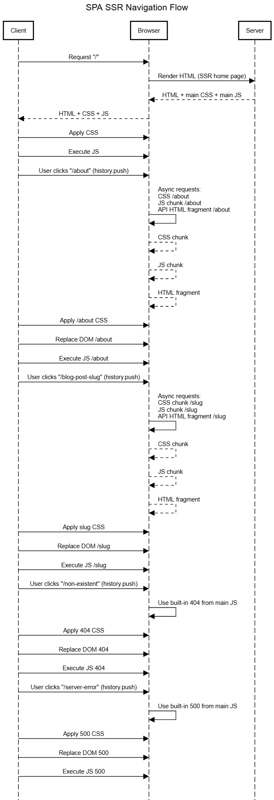

# SPA-JSPLUS

SPA-JSPlus is a simple implementation of a **Single Page Application (SPA)** built with **vanilla JavaScript**.
This project is **not a library or framework**, but rather a **pattern/example** that demonstrates how SPA needs can be solved without relying on modern frameworks.

The goals are:

* To inspire developers who still enjoy working with **vanillaJS**.
* To provide a real-world example of how routing, state, and lifecycle management can be achieved with minimal code.
* To be easily adopted or customized for project-specific needs.

---

## Demo: Blog (Hybrid SSR + SPA)

This is a **hybrid Single Page Application (SPA)** demo blog built using **vanilla JavaScript**, combining server-side rendering (SSR) for SEO-friendly pages with SPA navigation for smooth user experience.

---

## Table of Contents

* [Overview](#overview)
* [How It Works](#how-it-works)

  * [Initial Load / SSR](#initial-load--ssr)
  * [Navigation / SPA](#navigation--spa)
  * [Dynamic Content Loading](#dynamic-content-loading)
  * [History API & PushState](#history-api--pushstate)
  * [404 & 500 Handling](#404--500-handling)
* [Sequence Diagram](#sequence-diagram)
* [Demo](#demo)
* [Running the Demo](#running-the-demo)
* [Summary](#summary)

---

## Overview

In this demo blog:

* The **first request** or browser refresh always returns a **full HTML page** from the server, depending on the path (e.g., `/article-bla-bla-bla` → `article-bla-bla-bla.html`). This ensures **SEO-friendly content**.
* After initial load, JavaScript **hydrates the page** and takes control of navigation.
* SPA navigation happens via `history.pushState` without reloading the page.
* Dynamic content is fetched asynchronously as needed.

This hybrid approach combines **SEO benefits of SSR** with **smooth client-side navigation of SPA**.

---

## How It Works

### Initial Load / SSR

1. Browser requests a path from the server (e.g., `/article-bla-bla-bla`).
2. Server responds with **full HTML content** for that path.
3. Browser parses HTML → CSS is applied → JS executes.
4. JavaScript **hydrates the page** and attaches event listeners for SPA navigation.

### Navigation / SPA

* Clicking a link triggers a **JS event listener** instead of a full page reload.
* SPA intercepts the event and:

  1. Performs asynchronous fetch of the new content.
  2. Injects the content into the DOM.
  3. Updates the URL via `history.pushState`.

### Dynamic Content Loading

* Content (posts, comments, etc.) is fetched asynchronously.
* Parallel requests may occur, but rendering is applied in the correct sequence.
* SPA ensures a smooth experience without full page reloads.

### History API & PushState

* `history.pushState` changes the URL without reloading.
* `popstate` event triggers JS to fetch or re-render content when navigating back/forward.
* SPA keeps browser navigation consistent while avoiding reloads.

### 404 & 500 Handling

* Non-existent paths trigger custom 404 page rendered by SPA.
* Server errors (500) are caught and displayed by SPA without breaking navigation.
* Exception: on **first load**, 404/500 may come directly from the server response.

---

## Sequence Diagram

This section describes the **hybrid SSR + SPA flow**:



1. **First Request / Browser Refresh**

   * Browser requests a specific path (e.g., `/article-bla-bla-bla`).
   * Server responds with **full HTML** for that page.
   * Browser parses HTML → CSS applied → JS executes → SPA hydrates the page.

2. **Navigation via SPA**

   * User clicks a link.
   * JS intercepts the click and prevents full reload.
   * SPA performs **asynchronous fetch** of new content.
   * DOM is updated, and `history.pushState` updates the URL.

3. **Parallel Asynchronous Requests**

   * Multiple resources can be fetched simultaneously.
   * JS ensures rendering sequence is maintained for correct display.

4. **Back/Forward Navigation**

   * Browser triggers `popstate`.
   * SPA fetches or re-renders content corresponding to the URL.

5. **404 & 500 Handling**

   * Custom SPA 404 page for non-existent routes.
   * Server errors caught by SPA or returned as full HTML on first load.

---

## Demo

* Live demo link: [https://spademoblog.netlify.app/](https://spademoblog.netlify.app/)
* Demonstrates:

  * Initial SSR load per path for SEO
  * SPA navigation without reload
  * Asynchronous content fetching
  * Smooth back/forward navigation
  * Error handling (404/500)

### Screenshot


---

## Usage

### Development Mode (Direct HTML)

For quick testing during development, you can skip the build step:

1. Open the file `src/index.html` inside your editor.  
2. If you’re using **VSCode**, right-click `src/index.html` → **Open with Live Server**.  
3. The app will run immediately without bundling or running Node.js scripts.  

This mode is recommended for local development and debugging.

---

### Bundle

Generate the bundled JavaScript only (written into `dist/index.js`):

```bash
node run.bundle.js
```

---

### Build

Bundle + copy assets + preprocess files:

```bash
node run.build.js
```

---

### Start Build

Serve the `dist/` directory (production-like mode):

```bash
node run.start.js
```

---

### Build & Start Combined

You can also run build and then start immediately:

```bash
node run.build.js && node run.start.js
```

---

## Example Code

Here is a snippet from `src/index.js` showing how routes are declared:

```js
import app from "./app.js";
import {
  aboutBuilder,
  error404Builder,
  error500Builder,
  homeBuilder,
  singleBuilder
} from "./builders/index.js";
import setTransition from "./utils/setTransition.js";

/**
 * --------------------------------------------------------------
 * ROUTE CONFIGURATION
 * --------------------------------------------------------------
 * The following section defines how the SPA (Single Page Application)
 * should respond when the user navigates to different URLs.
 *
 * `app.reactor` registers routes:
 *   - First argument: route path(s)
 *   - Second argument: builder function that renders the view
 *   - Third argument (optional): error handler in case of failure
 *
 * `app.err` registers a fallback when no routes are matched.
 */

/**
 * --- Home reactor ---
 * Defines the entry points for the home page.
 * Matches three possible routes: "", "/", and "/home".
 * When any of these paths are visited, the `homeBuilder` is executed
 * to inject the home page template and logic into the app container.
 * 
 * If something fails while building the home page,
 * `error500Builder` will be called to render a server error page.
 */
app.reactor(["", "/", "/home"], homeBuilder, error500Builder);

/**
 * --- About reactor ---
 * Registers the "/about" route.
 * Visiting this path will call `aboutBuilder`, which renders the "About" page.
 * If rendering fails, `error500Builder` provides a graceful fallback.
 */
app.reactor("/about", aboutBuilder, error500Builder);

/**
 * --- Single reactor ---
 * Registers the dynamic "single" route.
 * The syntax `/{slug}` means this route can match any path like "/article-123".
 * Example: "/hello-world" will call the `singleBuilder` with a context
 * containing `{ slug: "hello-world" }`.
 * 
 * If rendering fails, `error500Builder` provides a graceful fallback.
 */
app.reactor("/{slug}", singleBuilder, error500Builder);

/**
 * --- Error reactor ---
 * Handles cases when no registered route matches the requested path.
 * For example, navigating to "/does-not-exist" will call `error404Builder`,
 * which typically shows a "404 Not Found" page.
 */
app.err(error404Builder);

/**
 * --------------------------------------------------------------
 * APP NOTIFIERS
 * --------------------------------------------------------------
 * Notifiers are hooks that can be triggered during app lifecycle events
 * (like transitions or page loads). They allow adding visual effects
 * or executing logic automatically when certain conditions are met.
 */

/**
 * --- Transition notifier ---
 * Adds a notifier named "transition".
 * When triggered, it uses `setTransition` to show a visual indicator
 * (the element with id="transistor") for 1 second.
 * This is useful to provide feedback while navigating between routes.
 */
app.addNotifier("transition", setTransition);

/**
 * --- Page load notifier ---
 * Adds another notifier named "meet".
 * This also calls `setTransition`, but here it ensures the transition element
 * is hidden once the new page is ready.
 * 
 * Together with the "transition" notifier, this creates a smooth UX:
 * - "transition": show indicator when route changes
 * - "meet": hide indicator after content is loaded
 */
app.addNotifier("meet", setTransition);

/**
 * --------------------------------------------------------------
 * APP START
 * --------------------------------------------------------------
 * Finally, start the application routing.
 * Calling `app.tap()` initializes the system, binds all the reactors
 * and notifiers, and makes the SPA ready to handle navigation.
 */
app.tap();
```

---

## Summary

This hybrid SSR + SPA approach combines:

* **SEO-friendly initial load** with server-rendered HTML per path
* **SPA navigation** for fast client-side transitions
* **Asynchronous content fetching** for dynamic updates
* **History API** for seamless URL management
* **Error handling** for both first load and client-side navigation

It provides the best of both worlds: **search engine optimization** and **modern SPA experience**.

---

## Notes
- The SPA core implementation is located at: `spa.js`.  
- This project is licensed under **MIT** → free to study, modify, and use.  
- It is not an official library, but rather a pattern & experiment for vanillaJS lovers.  

---

## License

This project is licensed under the MIT License.
