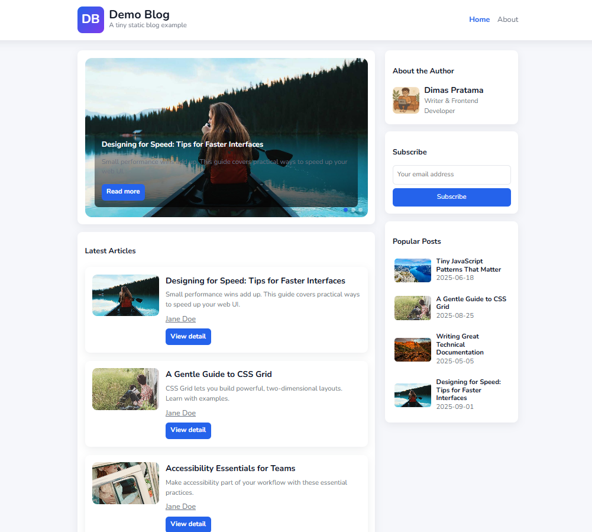

# SPA Demo Blog (Hybrid SSR + SPA)

This is a **hybrid Single Page Application (SPA)** demo blog built using **vanilla JavaScript**, combining server-side rendering (SSR) for SEO-friendly pages with SPA navigation for smooth user experience.

---

## Table of Contents

* [Overview](#overview)
* [How It Works](#how-it-works)

  * [Initial Load / SSR](#initial-load--ssr)
  * [Navigation / SPA](#navigation--spa)
  * [Dynamic Content Loading](#dynamic-content-loading)
  * [History API & PushState](#history-api--pushstate)
  * [404 & 500 Handling](#404--500-handling)
* [Sequence Diagram](#sequence-diagram)
* [Demo](#demo)
* [Running the Demo](#running-the-demo)
* [Summary](#summary)

---

## Overview

In this demo blog:

* The **first request** or browser refresh always returns a **full HTML page** from the server, depending on the path (e.g., `/article-bla-bla-bla` → `article-bla-bla-bla.html`). This ensures **SEO-friendly content**.
* After initial load, JavaScript **hydrates the page** and takes control of navigation.
* SPA navigation happens via `history.pushState` without reloading the page.
* Dynamic content is fetched asynchronously as needed.

This hybrid approach combines **SEO benefits of SSR** with **smooth client-side navigation of SPA**.

---

## How It Works

### Initial Load / SSR

1. Browser requests a path from the server (e.g., `/article-bla-bla-bla`).
2. Server responds with **full HTML content** for that path.
3. Browser parses HTML → CSS is applied → JS executes.
4. JavaScript **hydrates the page** and attaches event listeners for SPA navigation.

### Navigation / SPA

* Clicking a link triggers a **JS event listener** instead of a full page reload.
* SPA intercepts the event and:

  1. Performs asynchronous fetch of the new content.
  2. Injects the content into the DOM.
  3. Updates the URL via `history.pushState`.

### Dynamic Content Loading

* Content (posts, comments, etc.) is fetched asynchronously.
* Parallel requests may occur, but rendering is applied in the correct sequence.
* SPA ensures a smooth experience without full page reloads.

### History API & PushState

* `history.pushState` changes the URL without reloading.
* `popstate` event triggers JS to fetch or re-render content when navigating back/forward.
* SPA keeps browser navigation consistent while avoiding reloads.

### 404 & 500 Handling

* Non-existent paths trigger custom 404 page rendered by SPA.
* Server errors (500) are caught and displayed by SPA without breaking navigation.
* Exception: on **first load**, 404/500 may come directly from the server response.

---

## Sequence Diagram

This section describes the **hybrid SSR + SPA flow**:


1. **First Request / Browser Refresh**

   * Browser requests a specific path (e.g., `/article-bla-bla-bla`).
   * Server responds with **full HTML** for that page.
   * Browser parses HTML → CSS applied → JS executes → SPA hydrates the page.

2. **Navigation via SPA**

   * User clicks a link.
   * JS intercepts the click and prevents full reload.
   * SPA performs **asynchronous fetch** of new content.
   * DOM is updated, and `history.pushState` updates the URL.

3. **Parallel Asynchronous Requests**

   * Multiple resources can be fetched simultaneously.
   * JS ensures rendering sequence is maintained for correct display.

4. **Back/Forward Navigation**

   * Browser triggers `popstate`.
   * SPA fetches or re-renders content corresponding to the URL.

5. **404 & 500 Handling**

   * Custom SPA 404 page for non-existent routes.
   * Server errors caught by SPA or returned as full HTML on first load.

---

## Demo

* Live demo link: [https://spademoblog.netlify.app/](https://spademoblog.netlify.app/)
* Demonstrates:

  * Initial SSR load per path for SEO
  * SPA navigation without reload
  * Asynchronous content fetching
  * Smooth back/forward navigation
  * Error handling (404/500)

### Screenshot



---

## Running the Demo

There are two ways to run the demo locally:

### 1. Using Node.js Scripts

1. **Build the project**

```bash
node run.build.js
```

2. **Start the server**

```bash
node run.start.js
```

* After starting, open your browser and navigate to `http://localhost:PORT` (replace `PORT` with the one shown in the console).

### 2. Using Live Server (VSCode)

* Install the **Live Server** extension in VSCode.
* Open the `/src` folder in VSCode.
* Either:

  * Right-click `index.html` → **Open with Live Server**, or
  * Open terminal in `/src` and run `Live Server` from the context menu.

This will serve the SPA demo directly without running Node.js scripts.

---

## Summary

This hybrid SSR + SPA approach combines:

* **SEO-friendly initial load** with server-rendered HTML per path
* **SPA navigation** for fast client-side transitions
* **Asynchronous content fetching** for dynamic updates
* **History API** for seamless URL management
* **Error handling** for both first load and client-side navigation

It provides the best of both worlds: **search engine optimization** and **modern SPA experience**.

---

## Notes
- The SPA core implementation is located at: `spa.js`.  
- This project is licensed under **MIT** → free to study, modify, and use.  
- It is not an official library, but rather a pattern & experiment for vanillaJS lovers.  

---

## License

This project is licensed under the MIT License.
