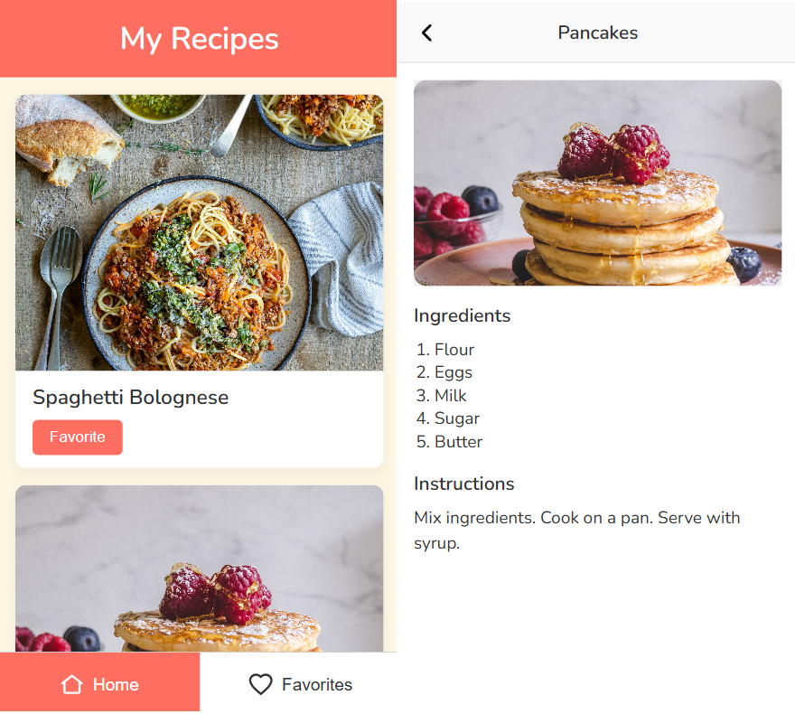

# SPA-JSPLUS

SPA-JSPlus is a simple implementation of a **Single Page Application (SPA)** built with **vanilla JavaScript**.
This project is **not a library or framework**, but rather a **pattern/example** that demonstrates how SPA needs can be solved without relying on modern frameworks.

The goals are:

* To inspire developers who still enjoy working with **vanillaJS**.
* To provide a real-world example of how routing, state, and lifecycle management can be achieved with minimal code.
* To be easily adopted or customized for project-specific needs.

---

## Demo: Recipe App

This folder (`examples/demo-recipe-app`) contains a **Recipe Application** built with the SPA-JSPlus pattern.
It demonstrates how to implement routing, modals, and state management in a real-world scenario using **vanilla JavaScript**.

### Features

* **Home Page** → Displays a list of recipes.
* **Favorites Page** → Shows only the recipes marked as favorite.
* **Recipe Details Modal** → Opens when you click a recipe, showing its ingredients and instructions.
* **Favorite/Unfavorite** → Toggle favorite status of each recipe.
* **Bottom Navigation** → Switch between Home and Favorites with active state styling.
* **404 Page** → Displays an error page for unknown routes.

### Screenshot



---

## Project Structure

```
examples/demo-recipe-app/
├── assets/                # Static assets (images, icons, etc.)
├── dist/                  # Build output (generated after build)
├── helpers/               # Helper modules (modal, rendering, etc.)
├── models/                # Data models
├── spa/                   # Core SPA engine (spa.js, router, etc.)
├── src/                   # Main source files
│   ├── 404.html           # Custom error page
│   ├── app.js             # Main app entry logic
│   ├── build.config.json  # Build configuration
│   ├── bundle.config.json # Bundle configuration
│   ├── favorites.html     # Favorites page
│   ├── index.css          # Styles
│   ├── index.html         # Main HTML entry point
│   └── index.js           # JavaScript entry point
├── run.build.js           # Run build (bundle + copy assets)
├── run.bundle.js          # Only run bundler
├── run.dev.js             # Start dev server (serve the application shortly)
├── run.start.js           # Start server for dist/
```

---

## Usage

### Bundle

Generate the bundled JavaScript only (written into `dist/index.js`):

```bash
node run.bundle.js
```

---

### Build

Bundle + copy assets + preprocess files:

```bash
node run.build.js
```

---

### Start Build

Serve the `dist/` directory (production-like mode):

```bash
node run.start.js
```

---

### Build & Start Combined

You can also run build and then start immediately:

```bash
node run.build.js && node run.start.js
```

---

## Example Code

Here is a snippet from `src/index.js` showing how routes are declared:

```js
import { app } from "./app.js";
import {
  closeModal,
  openModal
} from "./helpers/modal.js";
import { renderError } from "./helpers/renderError.js";
import { renderRecipes } from "./helpers/renderRecipes.js";
import { setActiveNav } from "./helpers/setActiveNav.js";

// --- Home reactor ---
app.reactor(["", "/", "/home"], function(ctx) {
  ctx.container = function() {
    return renderRecipes("/");
  };

  ctx.onMeet.set = function() {
    document.title = "Recipe App";
    setActiveNav("home-navigator");

    if (ctx.query.recipeId) {
      openModal(parseInt(ctx.query.recipeId));
    } else {
      closeModal();
    }
  };
});

// --- Favorites reactor ---
app.reactor("/favorites", function(ctx) {
  ctx.container = function() {
    return renderRecipes("/favorites");
  };

  ctx.onMeet.set = function() {
    document.title = "Recipe App - Favorites";
    setActiveNav("favorites-navigator");

    if (ctx.query.recipeId) {
      openModal(parseInt(ctx.query.recipeId));
    } else {
      closeModal();
    }
  };
});

// --- Error reactor (for unknown routes) ---
app.err(function(ctx) {
  ctx.container = renderError();

  ctx.onMeet.set = function() {
    document.title = "Recipe App - Page Not Found";
    setActiveNav(null);
  };
});

// --- Start app routing ---
app.tap();
```

---

## Live Demo

Try the live version here:
[https://spademorecipeapp.netlify.app/](https://spademorecipeapp.netlify.app/)

---

## Notes

* The SPA core implementation is located at: `spa.js`.
* This project is licensed under **MIT** → free to study, modify, and use.
* It is not an official library, but rather a pattern & experiment for vanillaJS lovers.

---

## License

MIT © dimaspandu
